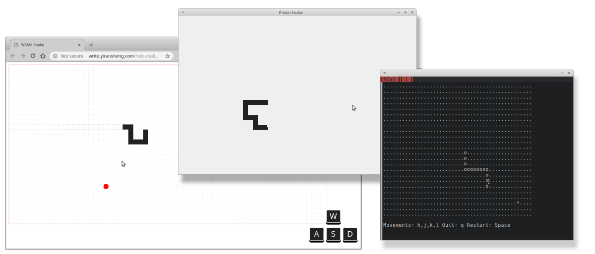
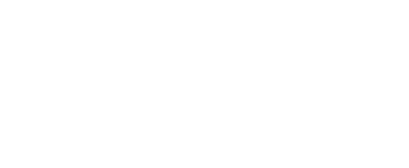

# Rust WASM Snake Game

Play Link: [http://yiransheng.github.io/rust-snake-wasm/](http://yiransheng.github.io/rust-snake-wasm/)





A weirdly designed snake game in rust & WebAssembley, primarily aimed for retained mode rendering targeting canvas. Two non-browser targets are also included in [./non_browser](./non_browser).

## Features

* Snake movements are animated and smoothed over
* Variable render speed, hold down direction keys to accelerate (opposite direction key to deaccelerate)



* VIM key bindings supported (h,j,k,l)
* `no_std`
* Retained rendering; in each tick, only one tile is drawn or cleared leaving vast majority of pixels on canvas untouched
* Perhaps too over-engineered, trying to explore various fun and unique abstractions afforded by rust
* Minimal world model completely decoupled from drawing code, easily ported over to other environments and rendering targets (although in trying to run it with piston, retained rendering doesn't quite work..)
  * ..and enabled writing unit tests nicely like so:

```rust
#[test]
fn test_death() {
    let snake_string = indoc!(
        "
        ..........
        >>>>>>v...
        ......v...
        ..^<<<<...
        .........*"
    );
    let afterwards = indoc!(
        "
        ..........
        .oooooo...
        ..o...o...
        ..ooooo...
        .........*"
    );

    let mut world: World<SmallRng, Bounding> = World::from_ascii(snake_string);

    while let Ok(_) = world.step(None) {}

    assert_matches!(world.step(None), Err(UpdateError::CollideBody));

    assert_eq!(&afterwards, &world.grid.to_string());
}
```


## Build

Requires:

- rust nightly
- wasm-bindgen
- npm / yarn

TODO: more details

